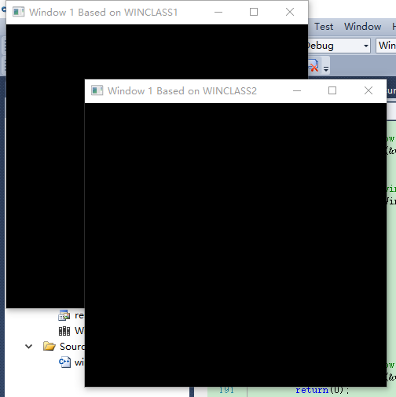

# 2-Windows Programming Model
For an example of opening two windows at once. Notice that when you close either window, they both close and the application
terminates. 

See if you can figure out a way to close only one window at a time. (Hint: Create two Windows classes, and don’t send a WM_QUIT message until both windows
have been closed.)

