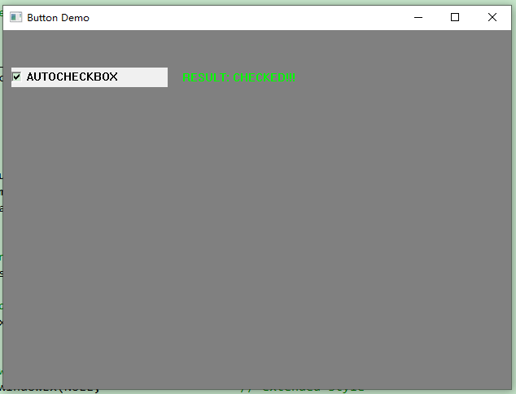
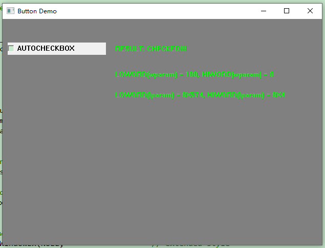

# 4.5.2 Using Controls

1. Sending Messages to Child Controls
2. Used to set the check on a check box or radio button.
3. Used to retrieve the current state of the button check. Possible return values
   are shown here.

